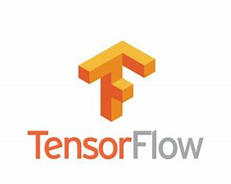
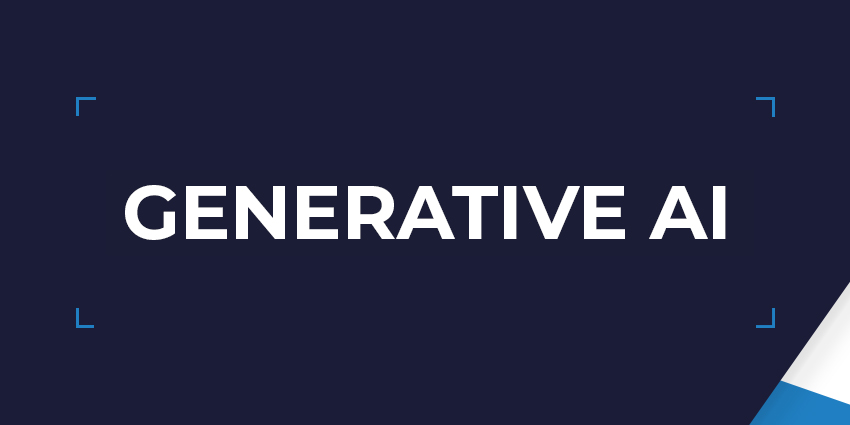

### Bonjour 👋

 

Suvam embodies the role of an _Machine Learning Engineer_ within the dynamic landscape of the insurance sector, showcasing an expansive skill set that transcends into the realms of Cloud and Machine Learning. Suvam is instrumental in the conceptualization and execution of cutting-edge classification models. His expertise extends to the intricate domains of Natural Language Processing (NLP) and text analytics, where he skillfully distills actionable insights for the resolution of real-world challenges.

Operating within the intricate ecosystem of Microsoft Azure, Suvam masterfully navigates the machine learning suite, seamlessly integrating tools such as Function Apps and Azure Cognitive Services. His prowess lies in the artful construction of pipelines and the adept utilization of machine learning libraries, ensuring the efficient and effective implementation of a diverse array of machine learning models. Beyond the technicalities, Suvam brings a wealth of experience in prompt engineering techniques and the nuanced craft of model fine-tuning, showcasing a profound understanding of the intricacies involved in the optimization of machine learning solutions.

👨‍💻 All of my projects are available at [Projects](https://github.com/suvam-09?tab=repositories)

<h4 align="left">Connect with me:</h4>

<h4 align="left">👨‍💻 Language & Tech:</h4>

<code></code>
<code></code>
<code></code>
<code></code>
<code></code>
<code></code>
<code></code>
<code></code>

